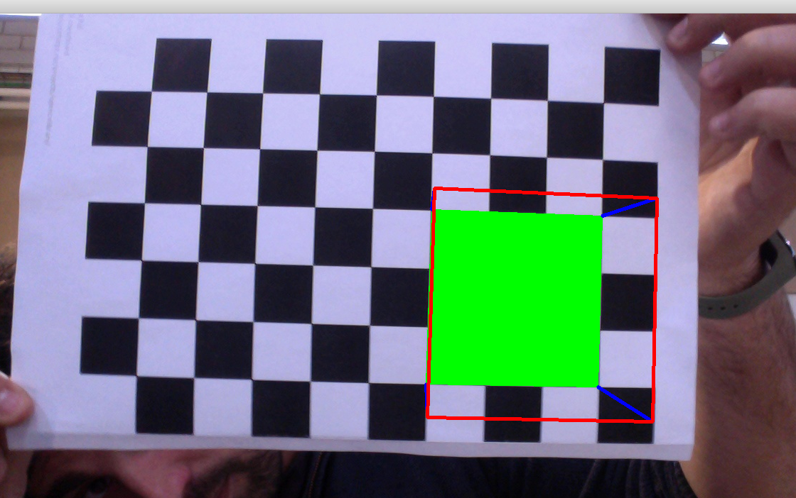

---
title: "Pràctica visió per computador"
author: [Gil Gassó Rovira i Marc Sànchez Pifarré, GEINF (UDG-EPS)]
date: 2019-04-14
subject: "Udg - Eps"
tags: [Visió per computador]
subtitle: "Tutor de la pràctica : Josep Forest"
titlepage: true
titlepage-color: 06386e
titlepage-text-color: FFFFFF
titlepage-rule-height: 4
...

# Pràcitca 2 - Robòtica

**Sobre què parlar :**

- Eixos de referència
- Guanyança de la càmera

**Parts de la pràctica :**

## Descripció general del document

En aquest document s'hi presenta el resum de concluisions extretes de la realització de la pràctica 2 de Visió per computador. En aquesta pràctica se'ns demana realitzar el calibratge d'una càmera i la representació d'objectes 3D en realitat augmentada.

## Context en el que es realitza la pràctica

### Hardware

El tipus de càmeres que s'utilitzen són les càmeres embbeded dels portàtils o les webcams del laboratori que són càmeres amb òptica pinhole que utilitzen sensors de tipus CMOS. De fet aquest tipus de sensors son els que trobem al 99% dels models de càmeres actuals.

### Il·luminació

La il·luminació que s'utilitza per realitzar aquesta pràctica no és una il·luminació directe cap a l'objecte en qüestió (el tauler d'escacs) sinó que s'aprofita la il·luminació ambiental que es disposa al laboratori. 

No s'ha aplicat cap tipus d'il·luminació diferent a l'ambiental però un altre tipus d'il·luminació que hauriem pogut utilitzar per a destacar els contrastos de les cantonades del tauler d'escacs pot ser qualsevol tipus d'il·luminació directe que realci el contrast, com per exemple un Ring o un Spot. 

### tauler d'escacs

Tal com es comenta a l'enunciat el tauler d'escacs és una eina simple que ens permet, mitjançant el contrast dels quadrats blancs i negres, realitzar un calibratge prou precís per a la representació de figures 3D en realitat augmentada. 

El **contrast**, representat per les interseccions entre els quadrats blancs i negres del tauler d'escacs, hi juga un paper molt clau a l'hora de realitzar el calibratge per que ens proporciona uns punts fàcilment distingibles situats en un pla de l'espai.

## Calibratge 

### Descripció de l'acció de calibrar

Donat un punt focal que té l'origen al sistema de coordenades de la càmera i un tauler d'escacs situat a un pla del sistema de coordenades del món, la feina del calibratge emana sobre l'acció de representar els punts del pla imatge dins del sistema de coordenades del món i discretitzar-lo de manera que mitjançant la triangulació es pugui determinar propietats de l'objecte representat en el pla imatge, en aquest cas el tauler d'escacs. 

### Procediment del calibratge 

Mitjançant el codi proporcionat i la seva execució s'han enregistrat diferents fotogrames on hi apareix l'objecte que s'utilitza per calibrar la càmera, (tauler d'escacs), representat en el diferents plans dins del sistema de coordenades del món. 

Per cada representació esmentada el calibratge realitza els següents passos : 

1. Situar l'origen del sistema de coordenades de la càmera en un punt del sistema de coordenades del món.

2. Projectar els punts, en aquest cas les interseccions dels quadrats del tauler d'escacs, al pla imatge dins del sistema de coordenades del món i determinar *entre altres* la distància focal. 

3. Cada fotograma incorpora una petita distorsió proporcionada per la len pinhole, en concret una distorsió radial.

4. Es sitúa el sistema de coordenades de la imatge en 2D sobre el pla imatge. 

En general OpenCV2 utilitza factors radials i tangencials per calcular la matriu de distorsió que permetrà calibrar la càmera per que el tipus de lent no afecti al resultat final de la discretització de la imatge, veure la referència *1 - Camera Calibration with OpenCV*.

El que vam fer va ser reproduïr el procés explicat a la referència *1 - Camera Calibration with OpenCV* peró en viu, és a dir sense passar-li imatges i fent que la captura de video cada x temps realitzés un fotograma. Quants més fotogrames li passem a la matriu de calibratge més precís és el resultat d'aquest calibratge i conseqüentment millora l'estimació de la posició de l'objecte representat en el sistema de coordenades del món.

##  Pose Estimation

En aquest apartat s'explicarà amb detall els components de la matriu de calibratge realitzada mitjançant la captura dels 10 fotogrames amb el sistema d'estereovisió (10 fotogrames cada càmera). 

Es pot veure la sortida del procés de calibratge realitzat en l'apartat d'esterovisió al fitxer "sortida2cams.txt". En general el calibratge amb dues perspectives és el mateix que el calibratge amb 1 sola perspectiva peró el què canvia és que amb 2 perspectives necessites quadrar els temps de captura i unificar els dos fotogrames simultanis mitjançant la instrucció cv2.stereoCalibrate(), veure la referència *2 - Camera Calibration and 3D Reconstruction*. 

A mesura que es van discretitzant els fotogrames es va emplenant el que s'anomena el model de la càmera (camera_model) que no deixa de ser el diccionari amb tots els punts que s'han recollit expressats de la següent manera : 

```
Intrinsic_mtx_1 [[553.05486348   0.         324.3926378 ]
 [  0.         553.45015689 229.8780157 ]
 [  0.           0.           1.        ]]
dist_1 [[ 3.58530635e-02 -9.48637868e-01 -5.26278465e-03 -3.87420281e-03
   4.29571670e+00]]
Intrinsic_mtx_2 [[715.35935416   0.         321.6634394 ]
 [  0.         714.60277722 231.54998339]
 [  0.           0.           1.        ]]
dist_2 [[-6.14052418e-02  9.93783844e-01 -4.92704324e-03  2.57797233e-03
  -6.33308179e+00]]
R [[ 0.99996558  0.00601564 -0.00571376]
 [-0.00625317  0.99907669 -0.04250486]
 [ 0.00545279  0.04253912  0.99907992]]
T [[ 4.23885796]
 [ 0.96565357]
 [-0.70508252]]
E [[ 8.56509219e-04  7.45509567e-01  9.34795664e-01]
 [-7.28171856e-01 -1.84558831e-01 -4.23092921e+00]
 [-9.92126618e-01  4.22913516e+00 -1.74654545e-01]]
F [[-5.12417102e-09 -4.45691648e-06 -2.06676613e-03]
 [ 4.36098933e-06  1.10452530e-06  1.23451951e-02]
 [ 3.23789006e-03 -1.69087327e-02  1.00000000e+00]]
```

El codi anterior és la sortida referent a la fusió de 2 fotogrames mitjançant la funció cv2.stereoCalibrate i rebent com a paràmetres els resultats per cada fotograma de la crida a la funció cv2.calibrateCamera. 

### Anàlisi dels paràmetres. 

Com que el que es pretén és acabar presentant un punt 3D d'un sistema de referència del món a un punt 2D d'un sistema de referència de la càmera sobre el pla imatge, en el procés hi juguen els elements escenificats a la següent imatge : 


**on :**

- (X, Y, Z) : son les coordenades del punt 3D en l'espai de coordenades del món. 
- (u, v) : Cooedenades del punt 2D projectat sobre el pla imatge en pixels. 
- (cx, cy) : Punt principal sobre el pla imatge.
- (fx, fy) : LLargades focals expressades en pixels. 

Llavors el que es cerca és la matriu amb les components fx, cx, fy i cy que ens permetrà realitzar aquest procés. 

#### Intrinsic_mtx_1 i Intrinsic_mtx_2

Resultat del cv2.calibrateCamera de la càmera 1 representat en format matriu : 

``` 
[
    [fx, 0,  cx]
    [0,  fy, cy]
    [0,  0,  1 ]
]
```

```
Intrinsic_mtx_1 [[553.05486348   0.         324.3926378 ]
                 [  0.         553.45015689 229.8780157 ]
                 [  0.           0.           1.        ]]

Intrinsic_mtx_2 [[715.35935416   0.         321.6634394 ]
                 [  0.         714.60277722 231.54998339]
                 [  0.           0.           1.        ]]
```

#### dist_1 i dist_2

Vector de distorsions format amb 5 coeficients de distorisió com : 

```
[k1, k2, p1, p2, k3] 
```


**on :**

- k1, k2 i k3 son coeficients de distorsió radials. 
- p1 i p2 son coeficients de distorsió tangencials. 


```
dist_1 [[ 3.58530635e-02 -9.48637868e-01 -5.26278465e-03 -3.87420281e-03 4.29571670e+00]]

dist_2 [[-6.14052418e-02  9.93783844e-01 -4.92704324e-03  2.57797233e-03 -6.33308179e+00]]
```

#### R - Matriu de rotació

Matriu de rotació que s'aplicaria entre el sistema de coordenades de la primera càmera i el sistema de coordenades de la segona càmera. 

```
R [[ 0.99996558  0.00601564 -0.00571376]
   [-0.00625317  0.99907669 -0.04250486]
   [ 0.00545279  0.04253912  0.99907992]]
```

Podem comparar la matriu anterior amb la matriu identitat i ens n'adonarem que la càmera 2 pràcticament no està rotada en funció de la càmera 1. 

```
I [[ 1  0  0 ]
   [ 0  1  0 ]
   [ 0  0  1 ]]
```

### T - Vector de translació 

Com que la imatge està presa des de dos posicions diferents tenim 2 punts focals, aquest vector representa la distància a l'espai entre el punt focal de la càmera 1 i el punt focal de la càmera 2. 

Si pf1 és el punt focal a l'espai de la càmera 1 i pf2 és el punt focal a l'espai de la càmera 2, aplicant la translació T a pf1 tindriem pf2 sempre que estiguéssin en el mateix sistema de referència.

```
T [[ 4.23885796]
   [ 0.96565357]
   [-0.70508252]]
```

De fet en la matriu anterior veiem que la posició de la càmera 2 en funció de la càmera 1 és de 4.24cm sobre l'eix x, 0.97 cm sobre l'eix y i -0.7 cm sobre l'eix z, que significa que la càmera 2 està enganxada a la pantalla del portàtil on hi ha la càmera 1 (embedded) i que es sitúa 4.24cm a la dreta, un pèl més amunt i un fil més enfora. 

### E - Matriu essencial

Matriu que agafa els punts extrets de les imatges de les dues càmeres i construeix una matriu que representa les posicions relatives entre una càmera i l'altre, acaba relacionant les dues captures per poder extreure el valor conjunt. 

```
E [[ 8.56509219e-04  7.45509567e-01  9.34795664e-01]
   [-7.28171856e-01 -1.84558831e-01 -4.23092921e+00]
   [-9.92126618e-01  4.22913516e+00 -1.74654545e-01]]
```

cv2 ho utilitza aquesta matriu com a transformació entre la vista de la càmera 1 i la càmera 2. La matriu E relativitza la perspectiva entre una càmera i l'altre. 

Es fa servir també per al càlcul de la matriu fonamental. 

Veure la referència *3 - findEssentialMat* per a una explicació més acurada del càlcul.


### F - Matriu Fonamental

Ve a ser al forma bilineal de fer correspondre 2 punts de 2 sistemes de coordenades diferents. Ens permet relacionar el punt entre les dues càmeres. 

```
F [[-5.12417102e-09 -4.45691648e-06 -2.06676613e-03]
   [ 4.36098933e-06  1.10452530e-06  1.23451951e-02]
   [ 3.23789006e-03 -1.69087327e-02  1.00000000e+00]]
```

## Annexes 

### Exemple de Calibratge amb una sola càmera

Es veu representada la matriu de coeficients i el vector de distorsions.

```
camera_matrix:
- [992.2030465290455, 0.0, 672.9783890677685]
- [0.0, 988.9628211272332, 322.06622116670366]
- [0.0, 0.0, 1.0]
dist_coeff:
- [-0.09502689555607022, 0.10223723893932801, -0.0036757148328838926, 0.0022448212909430294,
  0.058308034924238285]
```

### Captures

A continuació annexem alguna captura per escenificar la feina feta. 




# References 

[1 - Camera Calibration with OpenCV](https://docs.opencv.org/2.4.13.7/doc/tutorials/calib3d/camera_calibration/camera_calibration.html)

[2 - Camera Calibration and 3D Reconstruction](https://docs.opencv.org/2.4/modules/calib3d/doc/camera_calibration_and_3d_reconstruction.html)

[3 - findFundamentalMat i findEssentialMat](https://docs.opencv.org/3.0-beta/modules/calib3d/doc/camera_calibration_and_3d_reconstruction.html#Mat%20findFundamentalMat(InputArray%20points1,%20InputArray%20points2,%20int%20method,%20double%20param1,%20double%20param2,%20OutputArray%20mask))